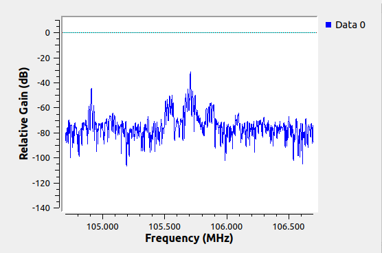
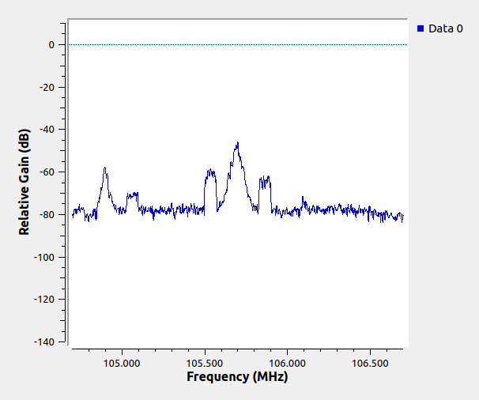
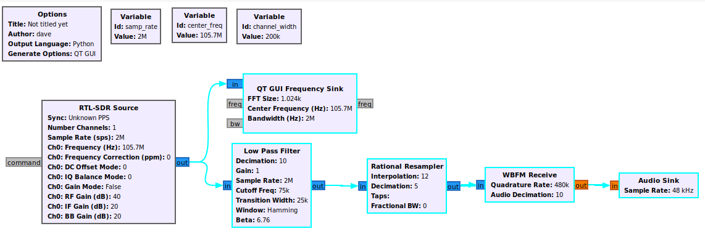

# SDR with Gnu Radio Part 1
In the [last post](vm_setup.md) I walked through getting a Linux VM setup and running Gqrx. With that, hopefully we are ready to try to use Gnu Radio. To install it
```
sudo apt install gnuradio
```
Then run it. It should start the graphical interface and if you have not used it before, it should start with a blank layout (aside from the Options and Variables boxes). First we just want to see if things are working at all, so try this:

1. Change the samp_rate variable to 2e6 (a rate known to work with rtl-sdr)
2. Drag a ‘RTL-SDR Source’ to the layout from the ‘OsmoSDR’ section on the right. Leave everything at the default except for the Frequency and set that to 105.7e6 or another local signal that you know is strong
3. Drag a ‘QT GUI Frequency Sink’ from the Instrumentation -> QT section on the right to the layout and put it to the right of the source you added in the previous step. Change the Center Frequency on this to the same frequency as in the previous step
4. Click on the blue, out box of the source and drag an arrow to the blue, in box of the frequency sink.
5. Click the play button up top to run the layout (you may have to save your work to a file before it runs)

If your setup is like mine, you will see a noisy line and wonder what is happening. To see something that started to look like what was in the other two pieces of software, I needed to change the 'Ch0: RF Gain' in the source up to 40. Now it sort of looks like something is there.



The next thing to do to see what is happening better is to turn on averaging in the frequency sink. If I set it to ‘medium’ I get this:



This is now looking pretty good and everything seems to be working (I think I like the ‘low’ setting best for averaging.) Most of what is here is coming from this [first lesson](https://greatscottgadgets.com/sdr/1/). It just needed a bunch of adjustment to work with the current version of Gnu Radio, so I am duplicating part of it with what was needed to get it to work for me. (Useful spoiler alert from the future: In lesson 11 of the set, he uses QT GUI items and it is super useful to know that you can middle-click on the graph to get useful settings and features without having to set them in the config or turn on the ‘Control Panel’ in the Config tab of the settings).

Next I added a variable called center_freq and switched both objects to use this instead of 105.7 to make it easer to change the station. I still can’t see 106.5 clearly. Next let's do the steps needed to try to get the selected station to play on the speakers (for more info on why the following blocks and settings, watch the video at the link above).

1. Add another variable called channel_width and set it to 200e3 (the size of a single FM station)
2. Drag out a Low Pass Filter block from the Filters section and put it to the right of the source also. Connect an arrow to it from the source and change Decimation to 'int(samp_rate/channel_width)'. Then set Cutoff Freq to 75e3 and Transition Width to 25e3. Leave everything else at the defaults.
3. Drag out a Rational Resampler from the Resamplers section and place it to the right of the low pass filter. Change the Interpolation to 12 and the Decimation to 5. Then put an arrow from the low pass filter to the resampler
4. Drag out a WBFM Receive block from the Modulators section to the right of the resampler. Connect an arrow from the resampler to the WBFM block. Set the Quadrature Rate to 480e3 and Audio Decimation to 10.
5. Drag out an Audio Sink from the Audio section and place to the right of the WBFM block. Connect an arrow between them and set the audio Sample Rate to 48kHz from the drop-down.

When I run this, it works, but it is choppy and printing a bunch of 'aU's in the terminal window (lower left section). I am going to try to fix that by lowering the sample rate down to 1e6. This didn't work, but didn't harm anything, just narrowed the range in the frequency window. After trying many things this worked: create a file ~/.gnuradio/config.conf and put in:
```
[audio_alsa]
nperiods = 32
period_time = 0.010
verbose = false
```
Restart Gnu Radio and it now works. So definitely go through the real video and add other stuff from there, but this is how my simple setup looks overall


