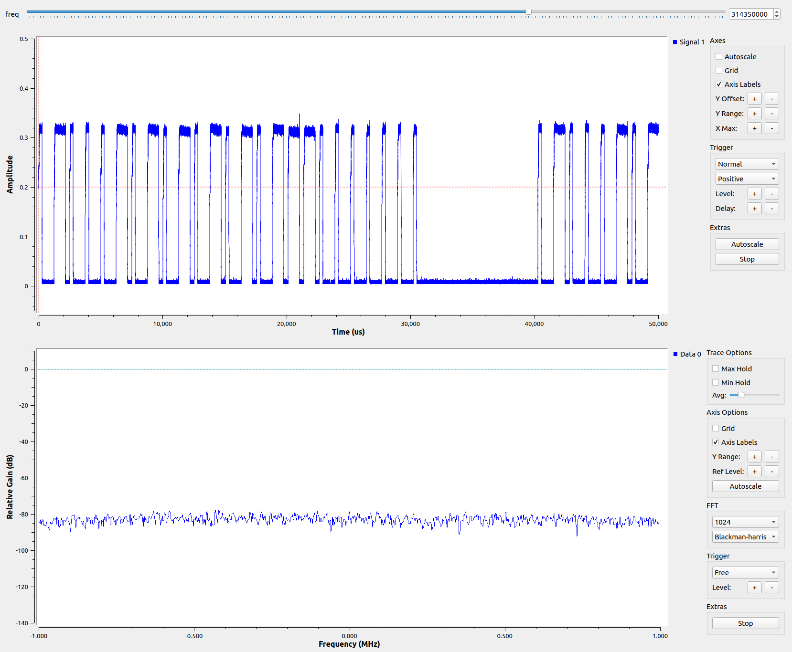
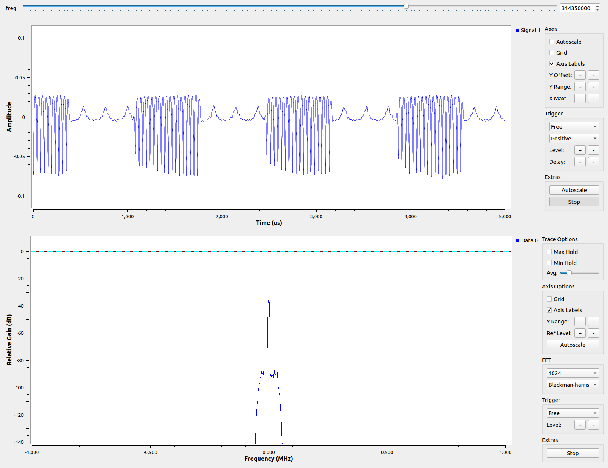
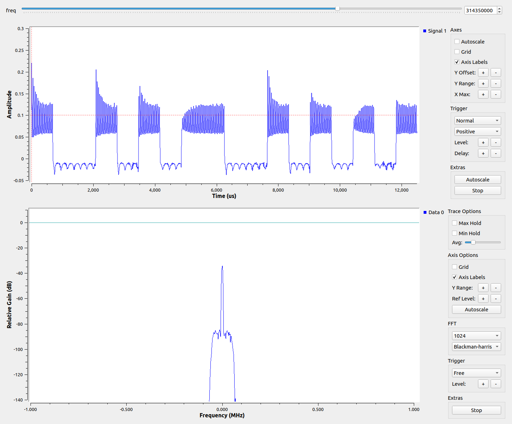
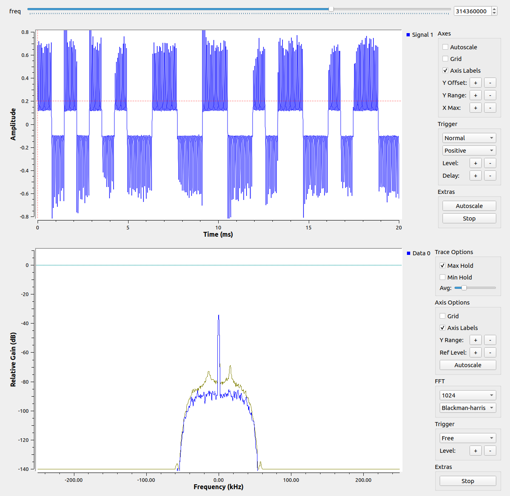

# SDR with Gnu Radio (following the Great Scott lessons)

## Notes from the 2nd to 4th lessons
These are mostly my learnings following the first few lessons in the Great Scott series [Software Defined Radio with HackRF](https://greatscottgadgets.com/sdr/) that uses Gnu Radio

Some things did not work correctly in the 2nd and 4th lessons due to it being taught on an older version of Gnu Radio. Just to remember the issues and the solutions:

* Covering the homework from lesson1 in lesson2, the WX GUI slider is missing.
Instead you can use the QT GUI Range block instead under the GUI Widgets -> QT section. It is also a variable itself, not controlling another variable.
* From lesson4 covering homework in lesson2, there is no WX GUI Scope Sink anymore.
Use QT GUI Time Sink located in Instrumentation -> QT instead.
* By default, the time sink could look different, or very different from the video depending on what you did during the homework and the settings. First, you will probably get too many cycles showing. To be able to fix that, you can configure the time sink and in the Config tab, turn the Control Panel setting to ‘Yes’. Now when you run the script, you will see you have a X Max: control that you can turn down to get something similar to what the video has.
* However, it might look some other shape than a nice cosine wave.
First check that your signal source is set back to ‘Cosine’. Then check that your Sample Rate: and Frequency: got set back to 32e3 and 1e3 respectively. For me, this got me back to normal, but you could have reset many other things in the homework as messing around was what we were supposed to do.
* I can’t see the dots and don’t have the control he is using.
To see the dots, go back into the Config tab for the time sink and change the Line 1 Style to ‘Dots’ (or whatever you like).
* Now when I zoom in to see the curve, stuff is moving around.
Use the drop-down in the Trigger area that is currently set to ‘Free’ and change it to ‘Auto’.

Other issues in these lessons seem very similar or were covered in the [previous post](gnu_radio1.md)

## More notes, from around lesson 8 to 11
* I was using a RTL-SDR at the time and needed a setting of 20 in the Ch0: RF Gain (dB): of the RTL-SDR Source block to see any real signal
* I was also using a car key fob for this test instead of the garage door opener and needed to look at a frequency of 314.35. However, the part about how to look up info about the key fob on the FCC website worked great
* There is a max hold for the QT GUI Frequency Sink that you will need to use instead of the WX GUI FFT Sink. If you don’t see it, you will need turn on the control panel in the Config tab for that block. To get a better view of the waveform you can use the scroll wheel to get a view that fits what happens when you activate the radio
* When the the scope sink is used in the video, use the QT GUI Time Sync from Instrumentation -> QT instead and again, turn on the Control panel from the Config tab for the block. Then use X Max to see the wave form patterns where he uses the Secs/Div: buttons
* I switch my RF toy from a key fob to a remote to a fog machine that was not on as I didn’t want to keep hitting buttons for my car. It was at 315MHz
* To get the time sync to look better I needed to try a bunch of manual settings. These seemed to work OK and are in the General and Trigger tabs
Number of Points: 400000
Y min: -0.05
Y max: 0.5
Trigger Mode: Normal
Trigger Level 0.2
* Then to just get one of the repeated messages I changed Number of Points to 100000. After I got an initial look, I could tell on the x-axis scale what I needed and then doubled the time to get the number of samples (points). Now I can count 1s and 0s just like in the video



Moving the the homework 8 portion of lesson 9 osmocom_fft works, but some things are missing/different. To get Peakhold, run ‘osmocom_fft -Q’ instead. This will show some additional controls, including Max Hold, which takes the place of Peakhold. Might as well set the frequency from the command line while we are at it:
```
osmocom -Q -f 314e6
```
Continuing with the homework from lesson 8, defaults are so different (and I don’t know what I am doing) that I can’t tell if my car key is the same as the one in the example. After putting in the same low pass filter, I have had to set the number of points to 10,000 in the QT GUI Time Sink and set the y-min/max to 0.06 and reset the trigger to free and just use the stop button like in the video. After a bit more adjustment, I see this:



I am picking up something (gain set to 20), but it is not the same and I don’t know if this is just different or I am doing something wrong.

## I found an antenna issue
I figured out what was wrong with my setup and causing the gain to need to be so high. The antenna shipped miss-wired. When the cable was routed through the plastic housing, it was pulled too firmly and this caused the outer wire and the resistor lead to touch and short the two sides of the dipole antenna. Pushing the cable back in a bit was all that was needed to remove the short.

So back in Gnu Radio, I could now turn off all the gain I needed to set previously and still get good signal. As the lesson 8 homework was reviewed in lesson 9, I found I needed some different settings again to get anything to look reasonable with the new GUI controls. For the low pass filter, I used a cutoff of 50000 and a transition width of 20000. For the time sink, I used the following:

* General:
  - Number of Points: 25000
  - Y min -0.05
  - Y max 0.3
* Trigger:
  - Trigger Mode: Normal
  - Trigger Level: 0.1

That made my example with a car key fob now look like this:



I don’t seem to have the bottom of the waveform. I found that my middle of the two frequncy of the peaks was just a little off. I tweaked that to 314.36 (+0.01), put the sample rate to 5e5 (to zoom in on the correct part a bit) and then set the following:

* Low Pass Filter:
  - Cutoff Freq: 40000
* QT GUI Time Sink:
  - General:
    * Number of Points: 10000
    * Y min -0.8
    * Y max 0.8
* Trigger:
  - Trigger Mode: Normal
  - Trigger Level: 0.2

Now I think I am close enough to what was in the lesson for the case of a car key.



Finally, I will jump to a couple of notes from the final lesson, 11:

* I decided not to transmit at this point, but did the the recording and analysis (just using the remote again).
* It was pretty frustrating, in 2021, to see in the last lesson, some information about the QT GUI components. So I put the best tip (middle mouse click to see missing options) back into the first blog post on this.
* In Inspectrum, just use the left/right scroll slider, since the orientation seems to have changed over the years, to make your way through the saved file.
* Since I did not do the shift for pickup on the second HackRF, I still have the false peak at the center. The rest of the band pass seems to work.
* Lesson 12, it seems, is a lie.
