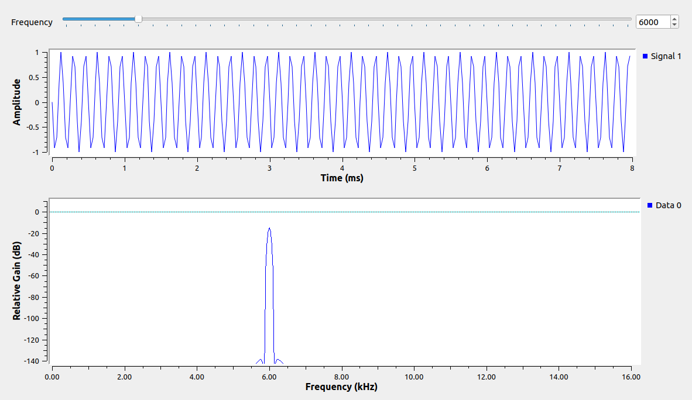
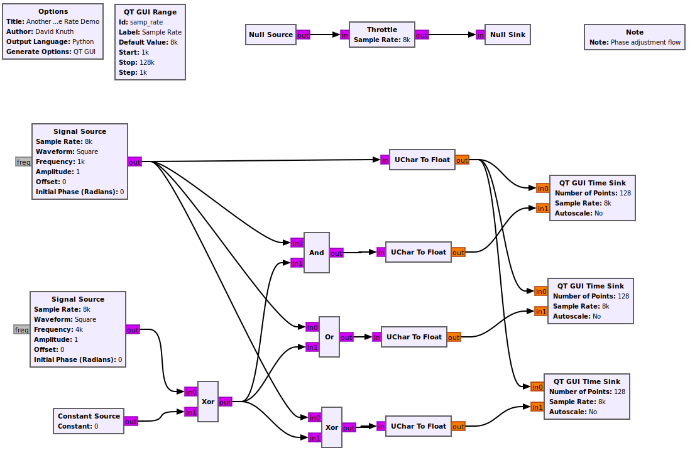

# Gnu Radio Tutorials
So we have worked our way through the Great Scott Gadgets videos, but I still feel like I need some basic training and reinforcement in how to use Gnu Radio. So, I am going to try to get that from the Gnu Radio tutorials [here](https://wiki.gnuradio.org/index.php/Tutorials). The first thing to do seems to be to try to [understand sample rates](https://wiki.gnuradio.org/index.php/Sample_Rate_Tutorial), which was also kind of covered in the other set of videos, but I think it could be more straight forward. So this is my take on sample rates.

I think the simplest way to say the [Nyquist-Shannon sampling theorem](https://en.wikipedia.org/wiki/Nyquist%E2%80%93Shannon_sampling_theorem) is to say:

If you want to accurately measure a frequency, you need at least twice the sample rate of that frequency. So, if you want to see a 1KHz frequency, you need at least 2k measurements per second.

Knowing that, lets rework the Gnu Radio tutorial on the subject slightly. If you don’t want to set up the flowgraph yourself from their tutorial, I have put them at the bottom of the post and you should be able to paste them into a file. Also, the discussion tab has key information to get things correctly working (set types to float and spectrum width to half in the frequency sink. It might also help to set the number of points to 256, but not needed). When set up, it should look like this:


See what things look like with frequencies of 2k 6k 12k and 16k. 2k has both a perfect cosine wave and and accurate frequency. 6k and 12k have increasingly weird waves, but still accurate frequencies. Then at 16k (half the sample rate) things look a bit odd everywhere, but still accurate for the frequency. If we keep going to 18k, the frequency is now 16k – mod(16k) and we really are no longer able to get accurate readings in the real world. Key learning, samples probably need to be at least twice the frequency and things will get interesting in the GHz range as sample rate will need to be very high. Here are outputs for the frequencies I listed above:





Continuing down the same tutorial page, is a very complex example (to me) that is then claimed to be ‘fairly straight forward’. Since I have no idea what that is all about and it needs some RTTY audio source and a mic, let’s skip to the next flowgraph, which looks like more fun.

Uh oh, there’s no Morse code vector source block. Can we do this without a git pull? Well, there is a ‘Python Block’ under Misc. Maybe we can use that and paste in some code from the repo to make it self contained? No, there is no way to make the type match or clear the input in an easy way. OK, fine, let’s pull it all from Git. Things seem to be running from the home directory, so let’s get a command window and do the following (assuming git is already present):
```
cd #To make sure we are in our home directory
git clone https://github.com/duggabe/gr-morse-code-gen.git
ls -lrt #To see what got added
```
So no new block type magically appeared and a restart of Gnu Radio does not help. You can get the whole flow diagram if you use File -> Open and MorseGen.grc from the new directory. OK so maybe not a lot learned about sample rate, save maybe that an audio out is typically at 48kHz. It looks like we would have to follow something from [here](https://wiki.gnuradio.org/index.php/OutOfTreeModules#Making_your_blocks_available_in_GRC) to get the Morse code block to show in the Custom section, but let’s call that out-of-scope for this post. So the point is that we need the end output rate to be 48kHz and we might have to do some multiplies and decimations to make sure it ends up that way (I think). It is a neat flow graph and maybe useful if you ever need an audio file or transmit of a certain Morse Code message.

The last flowgraph for the page seems to be setting a global flow rate over all and refers to possible issues with CPU similar to the HackRF videos. Maybe we can implement this one and put the samp_rate as a slider and see if we can generate more and less CPU load. My first flowgraph looks like this (tip: byte is the same as UChar):



However, when I try this, it just seems to use up a bit more CPU no matter which direction I go (well, the load number went up a bit. After getting to the issue I think it was just maxed out all the time). Adding a separate slider just for the throttle block and moving them both around, the effects are still unclear. Maybe they both have to be only variables set at the start, no. Turns out, the tutorial is out of date and that the throttle does have to be actually affecting the working part of the flowgraph, like this:


Now if you change the flow_rate variable, it does have a material impact on the CPU usage. I think I am done with sample rate for the moment and will head to the next tutorial.
