# Gnu Radio and FSK (Frequency Shift Keying)
Next I am going to try the FSK (frequency shift keying) example ([here](https://wiki.gnuradio.org/index.php/Simulation_example:_FSK)). Assuming I can get that to run well, I might try to extend the example to output the wave that the fog machine remote uses, which is ASK (amplitude shift keying). I would also guess that we could find something to that already built. First I will build the flowgraph as shown.

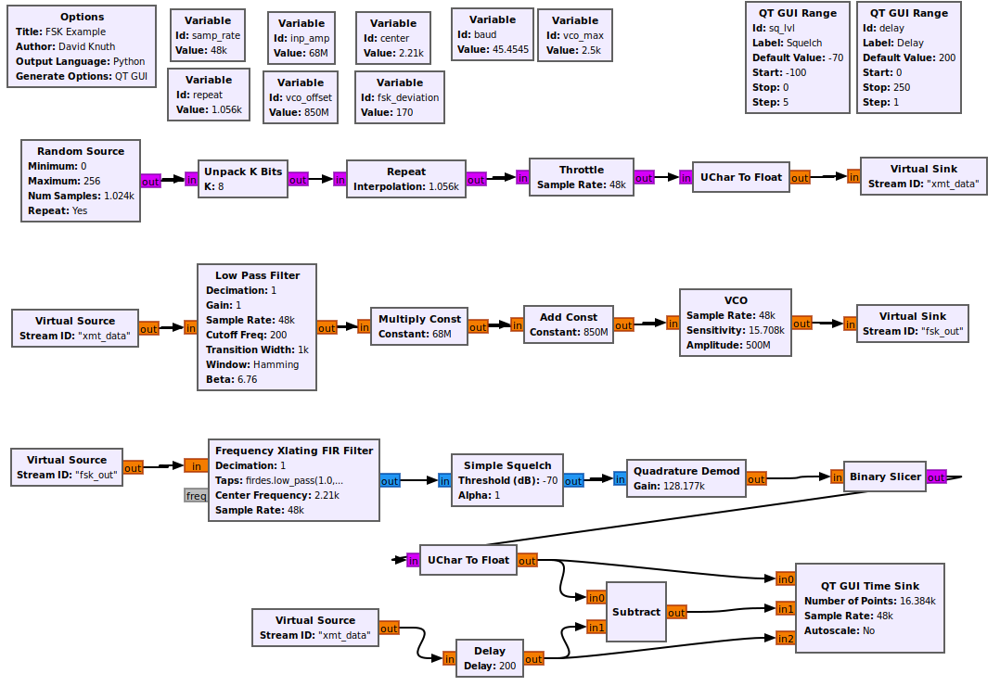

It runs, but the delay slider does not seem to do anything and everything seems lined up, but not exactly correct (no blue signal).

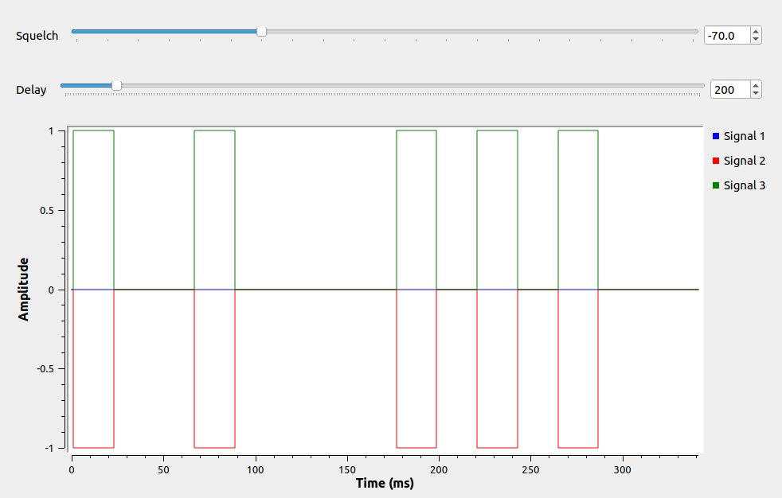

So after a little investigation, the part up to the xmt_data source is working, but somewhere in the rest is not. I need to figure out which part of the next two sections is failing. I try feeding in fsk_out to the time sink and it is constantly 500,000 with no change. I assume that means that there is a problem in the section that ends with that sink. Adding a block at a time, there is something wrong in my VCO block. Makes sense as I have no idea what that is. After some more searching, it turns out that 'M' (million) is not the same as 'm' (micro?) and the values were not listed in the description. A different example linked to a .grc file and it had the actual number used. Then I could reverse engineer that 500m = o.5 and 68m = o.o68. I fix all those, and it works. The .grc file is at the end so you can look at it.

Now, can we use some of this and get an output that looks like our ASK remote? Let’s start by just getting a set of ones and zeros to show up. So after staring at the screen with no idea how to start for a while, I figured I needed a file with some 1s and 0s and then run the part from “Unpack K Bits” onward. So I will need a file with some 1s and 0s, how do I get that? Maybe I can have Python generate that for me (I will worry about exact length and sequence later). So I poke around and come up with this Python script
```
#!/usr/bin/python3
from struct import *

remote_code = pack('BBBBBBBB', 0,0,0,1,1,1,0,0)
f = open('remote_bytes.dat', 'wb')
f.write(remote_code)
f.close()
```
Did you know there is no default 'python' anymore? You now have to say python3. So it wrote a file, how to I look at what it did. There is a hex editor called xxd installed by default and when I try that I see
```
dave@dave-RF:~$ xxd remote_bytes.dat
00000000: 0000 0001 0101 0000                      ........
```
I think that reads: line 0 has two 0s, then 01, then two 1s, then two 0s. That seems promising. However I now think I have a problem as "Unpack K Bits" will probably turn each 0 into eight 0s and each 1 into seven 0s and a 1. I could fix this with the python code and pack bit by bit or maybe I can use a "Packed to Unpacked" block and just use the file as is. I am going to go for the latter as a first try. I get it to run and so far the whole thing looks like this:

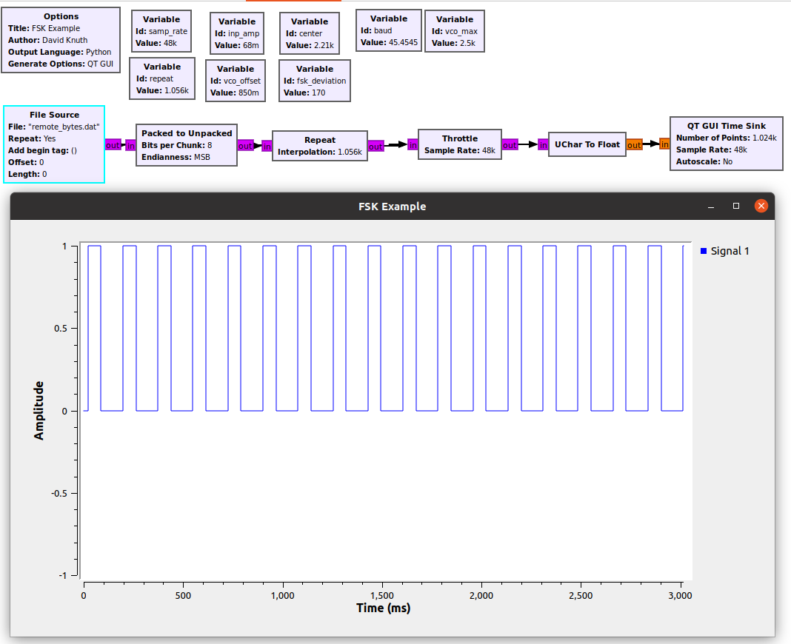

So on the good news side, something shows and it is 0 or 1. Bad news, I can’t quite tell if it is the sequence I wanted and I expect that it is not. It also seems to be slowly generating and I expected it to be pretty fast. First, let’s put more points into our time sink and see what happens. That only widens the peaks and valleys. So looped around repeatedly, this would make 5 low (0) and three high (1) and this is in-line with what we are seeing. Let’s try 12 bits instead of 8 and put just one 0 in-between different sets of 1s.

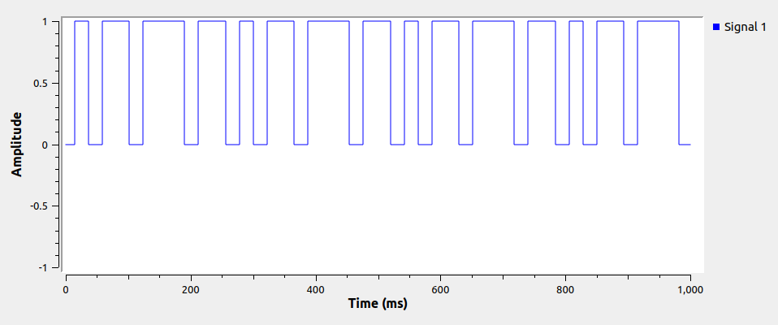

We have a smallest thing working. Probably time to go back and get a good capture of exactly what we are trying to simulate. It looks like we did have a good look at this in an earlier post, but here it is again:

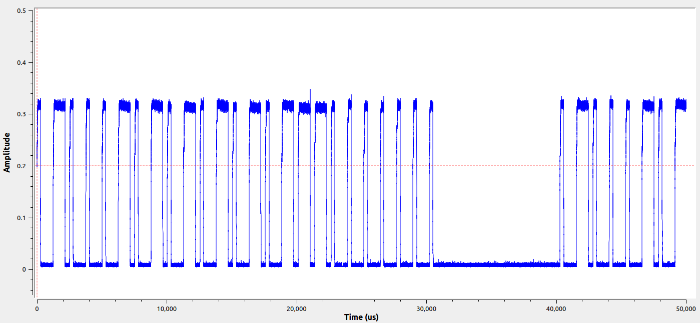

Looks like 010001010101010111000000

So we could probably do this with sets of 4 bits in our input file. Use 1000 for a zero and 1110 for a one then put in the break somehow. If we wanted to change the frequency or amplitude, that would be on the Gnu Radio side. Searching around, it seems [this blog](https://foo-manroot.github.io/post/gnuradio/sdr/2018/01/15/gnuradio-ook-transmit.html) lands on a similar approach to try to do this. I really like their use of a vector source block and a variable instead of a separate Python program to produce the flow of bits, so I think I will borrow that. Here’s what we have so far

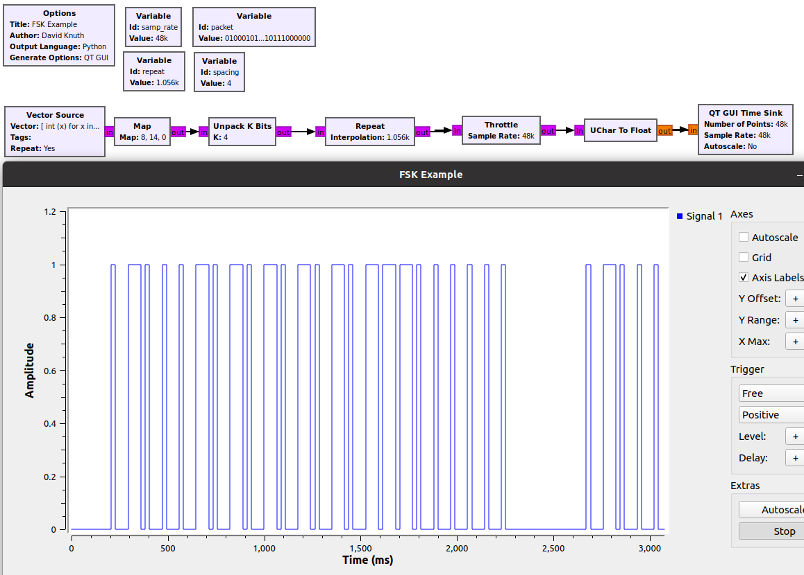

We are getting close. I would like the space to be bigger, but just need to tick up that variable. Also need a better timing match, but I am thinking the repeat variable should fix that. It is also probably time to fix the sample rate to whatever we are going to transmit at as that will affect the needed repeat setting. I set the sample rate to 2e6 as that is the value often used with the HackRF to transmit and then dialed the repeat back and forth until things looked about right. I also ended up moving the spacing up to seven.

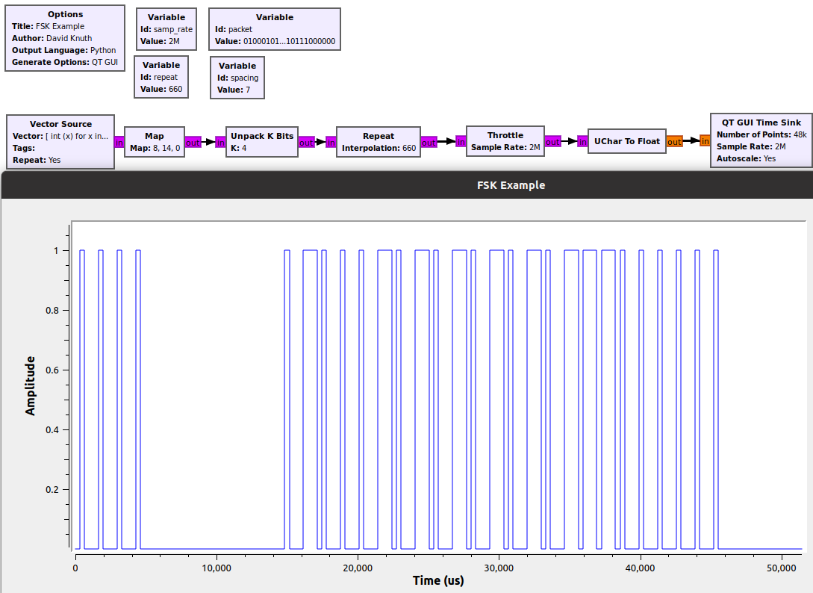

Now that we have a square wave that matches, we could probably just send that to the HackRF. However, most of these examples try to turn this into a wave that is slightly less square and I would guess that is what the missing blocks between the blog’s flowgraph and this one are doing. There was also something at the end of the HackRF tutorial series that touched on this. Since I have the blog example pulled up now, I will try that first. Just using the moving average block helps a bit, but adding in the rational resampler seems to make things crazy. It’s probably because I don’t know how to use it correctly, so let’s leave that out for the moment and try a transmit. I will setup the RTL-SDR.COM on another computer and see what happens when I run this:

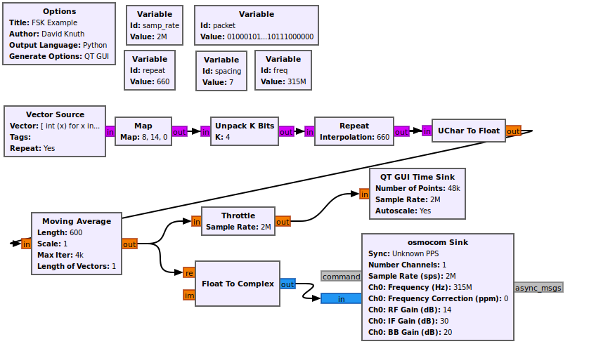

I had to set the RF and IF gain to 14 and 30 respectively to get a reasonably strong output.

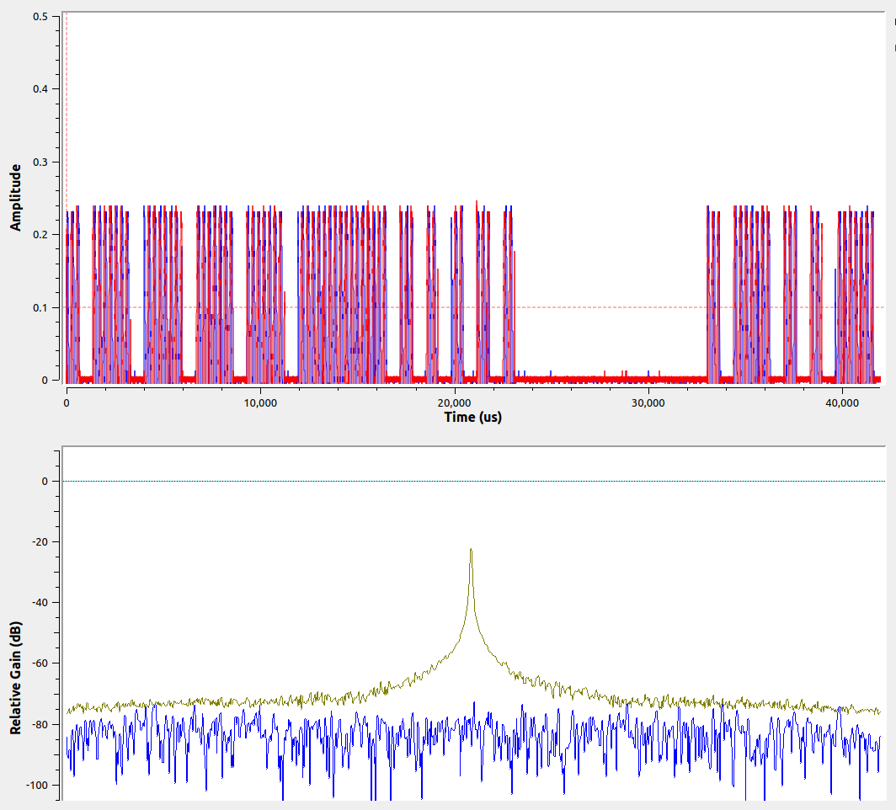

This is sort of working. Transmit frequency seems good and the break seems good and there is a nice difference between a 1 and a 0. There seems to be some trouble holding the high side of the amplitude and two of the 1s seem to have bridged. Let's start improving by just disabling the software throttle to see if that was having any effect on the hardware. That doesn’t seem to do anything, but increasing the transmit sample rate to 10e6 and the receive to 2e6 helps a little. Next I am going to go a bit farther towards the linked example and add in the Rational Resampler block again, remove my repeat block and add a baseband variable. Still pretty noisy compared to the remote itself, but time to test for real with the fog machine. It is not working. There is a multiply const block in the example, which also seems like it should be a no-op, but let’s try adding that in too. That does not seem to change anything. I tried adding in a slightly delayed 'im' wave from the main part in the "Float To Complex" block as it looked like the remote capture had that, but didn’t seem to do anything either.

I found another example to look at [here](https://zeta-two.com/radio/2015/06/23/ook-ask-sdr.html). This is a bit different in how it generates the sequence of bits and also in how it creates the waveform to send. Hopefully multiplying by a cosine wave gives the fuller output like the remote does. So with a setup like this:

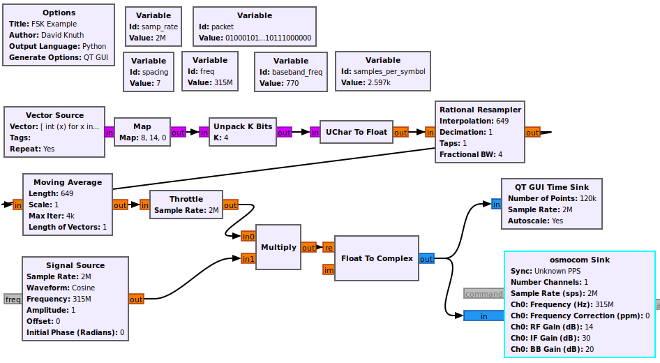

I get a send-side scope output like this:

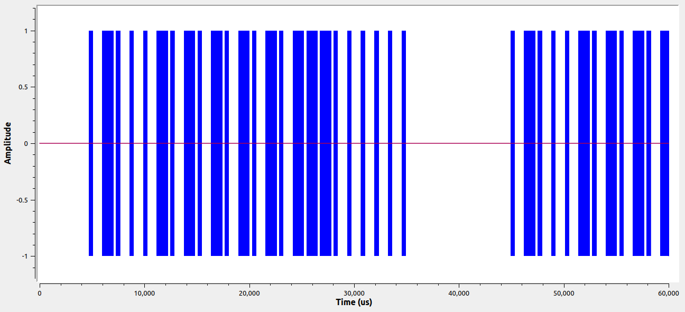

However, on the receiving PC, I see this:

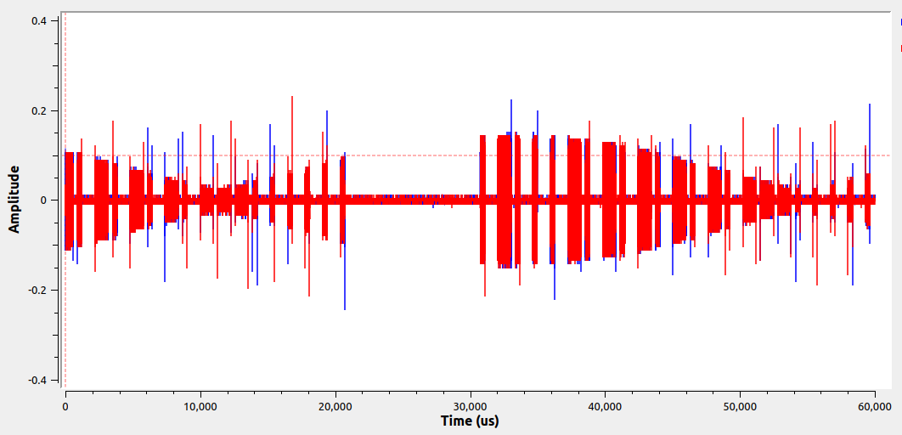

It looks like the cosine wave has really helped to fill out the 1 and 0 sections, but there is also another wave showing up in the overall amplitude. What is happening? Maybe a multi-clock issue with the throttle and the hardware clocks? Nope, still there. I put the throttle back and changed the sample rate to 10M on the transmit side and now I see long wave on the transmit side and nothing on the receive side. I change to 1M samples on the xmit side and now I lose the negative amplitude side of the xmit wave and see the thinner pattern on the receive side, same as before. So I have a sample rate issue of some type, but don’t understand it yet. If I set it back to 2M and try the fog machine, will it receive? Still no. I try increasing the sample rate to 8M in the cosine source and that starts looking good in the time scope everywhere, but the fog machine still did not receive. I notice the receive frequency seems off with peaks to each side of where it should be. Have I mentioned that I don’t know what I am doing? I try to put in my binary sequence and target frequency into a copy of the doorbell example, but I seem to get a random encoding of the wrong number of bits.

So the patterned interleaver did not work as I expected and the doorbell example uses 3 slots instead of 4 for the encoding. So after fixing that at least the randomness stops. I still see just the positive part of the wave with a 1M sample rate and both with 2M. The receive side is now doing the same thing as it did with the other way to artificially generate the stream. The fog machine will not activate, so now I have two ways to similarly fail. The doorbell example keeps both sides of the wave when I move the sample rate around and if I add the raw binary data to the time sink, I can zoom in and see about 55 cosign waves to each 1 bit (and it looks like there are 4 slight sub-waves). That is different than mine and again, has to be some frequency/sample rate issue. Should look like:

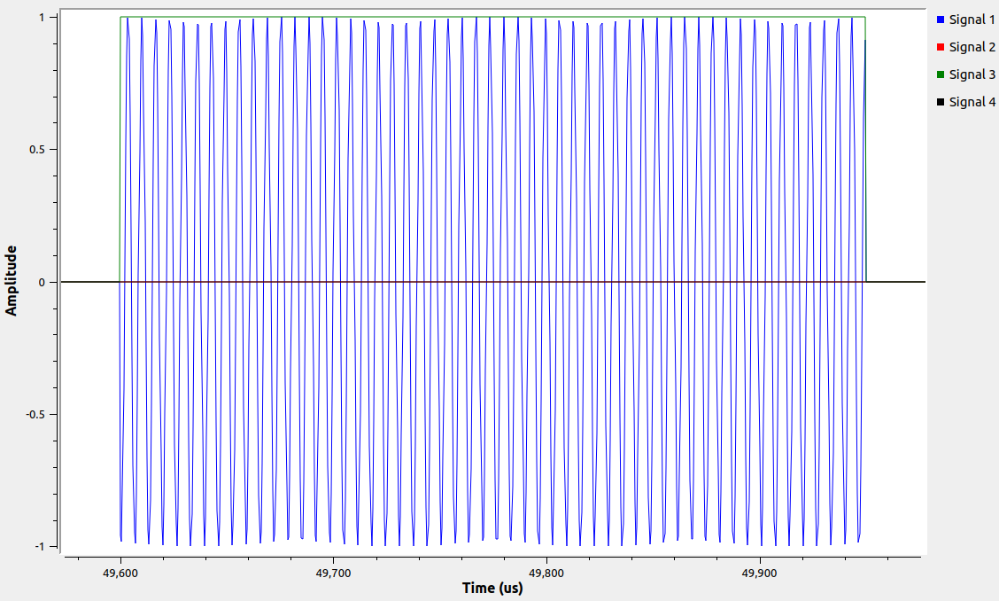

Mine has more crazy results when using a sample rate of 4M:

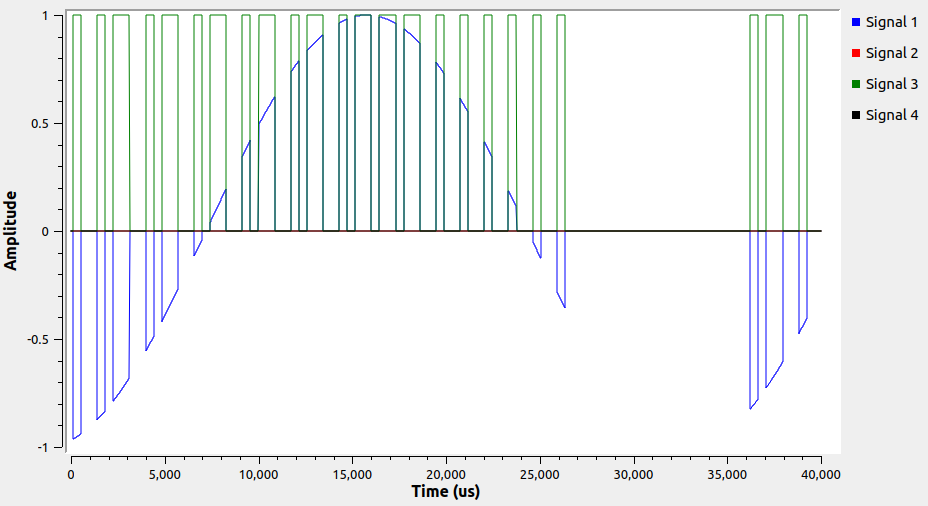

If I use a clean division of 315M * .43 (symbol size) like (315*.43)/25 or (315*.43)/50, the cosine seems to behave nicely inside the square wave. However, the frequency is dual peaking outside of the target of 315M. If I add a QT GUI Sink to the doorbell example, that also has this dual peak off center issue:

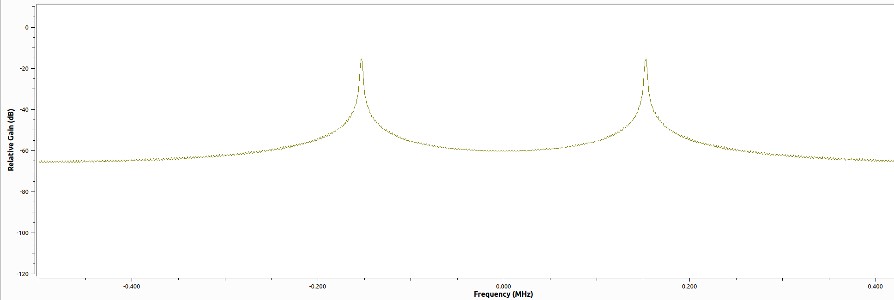

Your sample rate should be at least 2x greater than your frequency, otherwise you get aliasing effects as covered in the [sample rate examples](https://davidknuth.com/blog/wp-admin/post.php?post=771). So we may need some combo of the two examples to get something more like the actual remote.

I forgot a 0 at the end of the binary sequence. That is probably a big part of why these attempts were not working. Still, this combination of the two flowgraphs seemed to work pretty well (fog machine activated), was more stable and gave a richer signal that looked more like the one from the remote:

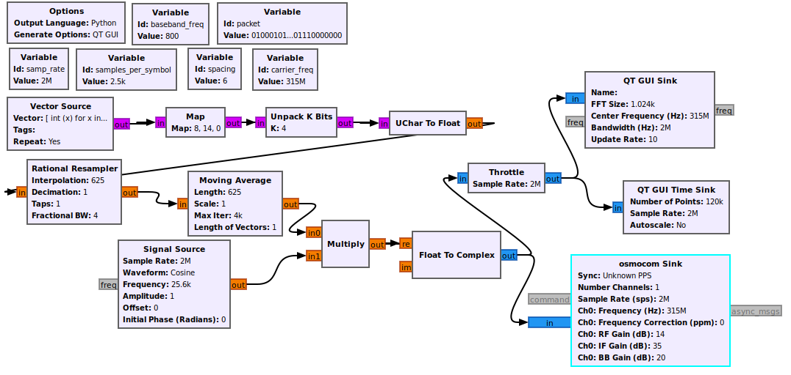

[The final grc file to copy the fog remote](generate_fog.grc)

[The grc file for the FSK example up top](fsk_example.grc)
